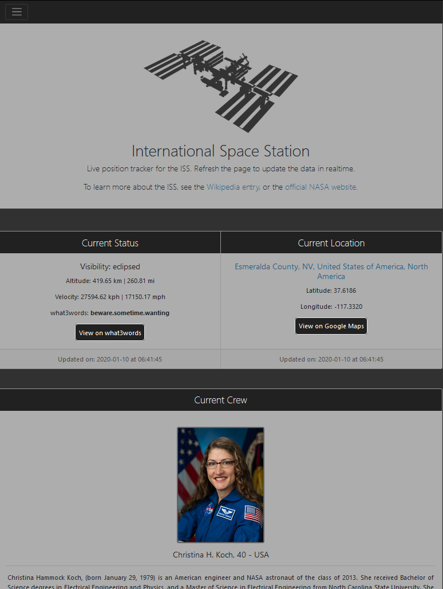

# ISS Tracker
###### Live location tracker for the International Space Station.
**Note: Project requires private API keys to work, which are not included in the source code for obvious security reasons. To see the site in action, [click here](https://dcxpython.pythonanywhere.com/).**

This project started as a simple Python script, written to learn how to use APIs by making HTTP requests, and dealing with JSON data to extract what I needed. The original file took data from two APIs, sent data to a third, and printed the resulting information to the console window.

I had a lot of fun with this project, so I thought it would be ideal for my first attempt to move away from the console window, and learn how to showcase Python with a proper UI.

This lead to me learning Flask so I could present the data with a bit of style in a web browser.

## Features:
- Display current latitude and longitude.
- Convert and display coordinates as nearest approximate address, {country, area, town} etc, or show body of water name if not above land.
- Display altitude and velocity, converted to both imperial and metric.
- Show visibility status (if ISS is in daylight or night).
- Show [what3words](https://what3words.com/) values and link to view location on what3words website.
- Link to view current location on Google Maps.
- List of current crew with names, profile images, nationalities and short bios (manually updated).
- Links to crew Wikipedia entries.
- Links to further reading, including Wikipedia main ISS article and official NASA website.

## Known Bugs:
- [ ] Issue with geocoding API which causes an index error when ISS is located over the South China Sea. This may apply to other areas but so far no others have been found. Possible formatting issue with JSON data.

## ToDo List:
- [x] Upload to host site
- [x] Write custom CSS to override Bootstrap defaults.
- [x] Links to credit API hosts.
- [ ] Update data in DOM automatically rather than having to refresh (within API request limits).
- [ ] Include map showing current location.
- [x] Add favicon.
- [ ] Improve design for current web accessibility guidelines.
- [ ] Include smaller images to load on smaller screens to save bandwidth on mobile.
- [ ] Test on legacy browser profiles.

## Credits:
- ISS data by http://open-notify.org and https://wheretheiss.at
- Geocoding by https://opencagedata.com
- Crew data and images from the official [NASA website](https://www.nasa.gov/mission_pages/station/expeditions/expedition61/index.html) and [Wikipedia](https://wikipedia.org).
